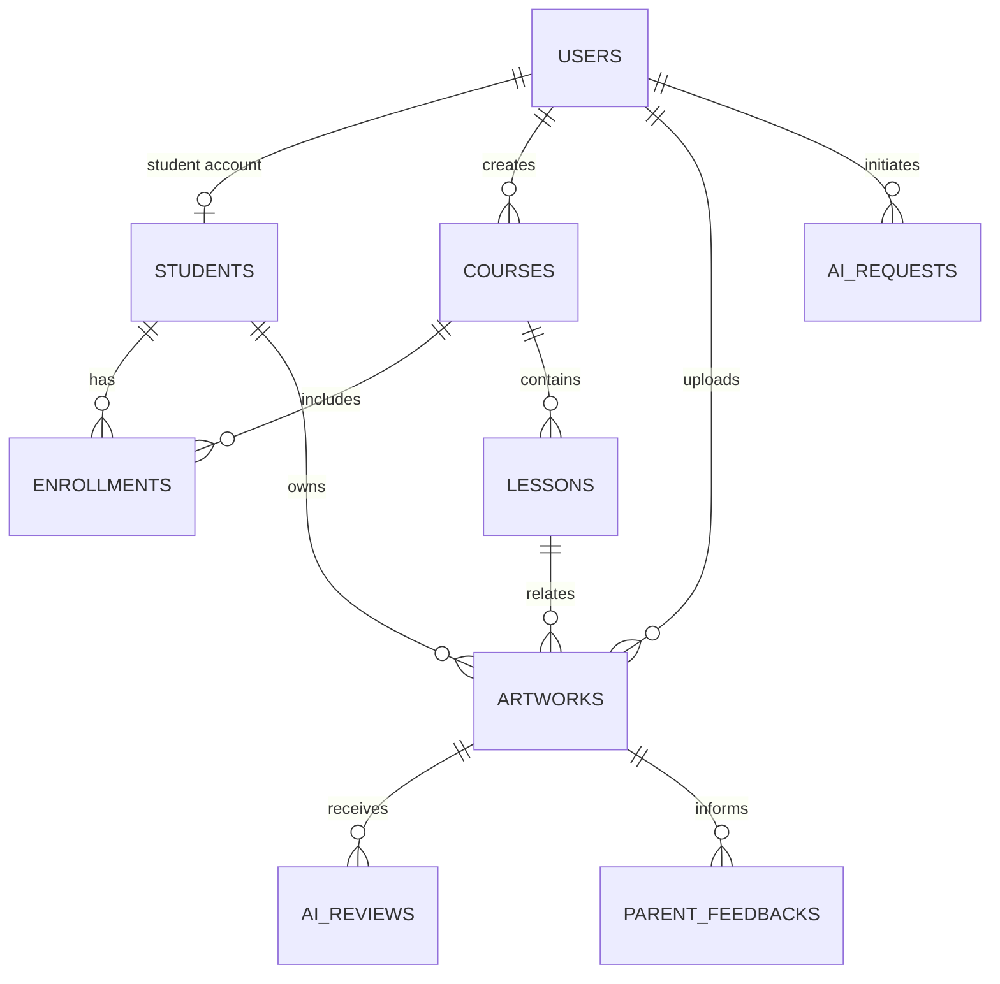

# 数据库设计｜SQLite（MVP v1.0）

## 设计原则

- 所有时间存 UTC ISO-8601 字符串（SQLite `TEXT`），接口按客户端时区展示。
- 主键使用 UUID（`TEXT`），由 API 层生成；避免暴露递增数量和未来迁移冲突。
- 业务表使用 `created_at`、`updated_at`；删除使用 `deleted_at` 软删除，图片文件由后台清理任务延迟删除。
- SQLite 启用 `foreign_keys = ON`、WAL 模式、每日备份。外键防止孤儿记录，应用层仍校验租户/角色权限。

## 实体关系



## 表说明

| 表 | 用途 | 关键字段 |
| --- | --- | --- |
| `users` | 全部登录账户 | username、password_hash、role、avatar_url、status |
| `students` | 学生业务档案 | user_id、name、birth_date、class_name、guardian_name |
| `parent_student_links` | 家长与学生关联 | parent_user_id、student_id、relationship |
| `courses` | 课程 | title、age_min、age_max、cover_url、teacher_id |
| `lessons` | 课程章节/任务 | course_id、title、sort_order、task_content |
| `enrollments` | 学生报名课程 | student_id、course_id、progress、status |
| `artworks` | 作品主记录 | student_id、course_id、lesson_id、image_url、status |
| `ai_reviews` | AI 点评及教师确认版 | artwork_id、payload_json、status、confirmed_by |
| `lesson_plans` | AI 教案草稿/保存稿 | course_id、input_json、content_json、created_by |
| `parent_feedbacks` | 家长通知草稿 | artwork_id、content、status、created_by |
| `ai_requests` | AI 调用审计/成本排错 | user_id、feature、status、latency_ms、error_message |

## SQLite 建表 SQL

```sql
PRAGMA foreign_keys = ON;
PRAGMA journal_mode = WAL;

CREATE TABLE users (
  id TEXT PRIMARY KEY,
  username TEXT NOT NULL UNIQUE COLLATE NOCASE,
  password_hash TEXT NOT NULL,
  display_name TEXT NOT NULL,
  role TEXT NOT NULL CHECK (role IN ('admin','teacher','student','parent')),
  avatar_url TEXT,
  status TEXT NOT NULL DEFAULT 'active' CHECK (status IN ('active','disabled')),
  created_at TEXT NOT NULL,
  updated_at TEXT NOT NULL,
  deleted_at TEXT
);

CREATE TABLE students (
  id TEXT PRIMARY KEY,
  user_id TEXT UNIQUE REFERENCES users(id) ON DELETE SET NULL,
  name TEXT NOT NULL,
  avatar_url TEXT,
  birth_date TEXT,
  class_name TEXT,
  guardian_name TEXT,
  guardian_phone TEXT,
  notes TEXT,
  created_at TEXT NOT NULL,
  updated_at TEXT NOT NULL,
  deleted_at TEXT
);

CREATE TABLE parent_student_links (
  id TEXT PRIMARY KEY,
  parent_user_id TEXT NOT NULL REFERENCES users(id) ON DELETE CASCADE,
  student_id TEXT NOT NULL REFERENCES students(id) ON DELETE CASCADE,
  relationship TEXT NOT NULL DEFAULT '家长',
  created_at TEXT NOT NULL,
  UNIQUE(parent_user_id, student_id)
);

CREATE TABLE courses (
  id TEXT PRIMARY KEY,
  title TEXT NOT NULL,
  age_min INTEGER CHECK(age_min BETWEEN 2 AND 18),
  age_max INTEGER CHECK(age_max BETWEEN 2 AND 18),
  description TEXT,
  cover_url TEXT,
  teacher_id TEXT REFERENCES users(id) ON DELETE SET NULL,
  status TEXT NOT NULL DEFAULT 'active' CHECK(status IN ('draft','active','archived')),
  created_at TEXT NOT NULL,
  updated_at TEXT NOT NULL,
  deleted_at TEXT,
  CHECK(age_max IS NULL OR age_min IS NULL OR age_max >= age_min)
);

CREATE TABLE lessons (
  id TEXT PRIMARY KEY,
  course_id TEXT NOT NULL REFERENCES courses(id) ON DELETE CASCADE,
  title TEXT NOT NULL,
  description TEXT,
  materials TEXT,
  task_content TEXT,
  sort_order INTEGER NOT NULL DEFAULT 0,
  created_at TEXT NOT NULL,
  updated_at TEXT NOT NULL,
  deleted_at TEXT
);

CREATE TABLE enrollments (
  id TEXT PRIMARY KEY,
  student_id TEXT NOT NULL REFERENCES students(id) ON DELETE CASCADE,
  course_id TEXT NOT NULL REFERENCES courses(id) ON DELETE CASCADE,
  progress INTEGER NOT NULL DEFAULT 0 CHECK(progress BETWEEN 0 AND 100),
  status TEXT NOT NULL DEFAULT 'active' CHECK(status IN ('active','completed','paused')),
  enrolled_at TEXT NOT NULL,
  updated_at TEXT NOT NULL,
  UNIQUE(student_id, course_id)
);

CREATE TABLE artworks (
  id TEXT PRIMARY KEY,
  student_id TEXT NOT NULL REFERENCES students(id) ON DELETE RESTRICT,
  course_id TEXT REFERENCES courses(id) ON DELETE SET NULL,
  lesson_id TEXT REFERENCES lessons(id) ON DELETE SET NULL,
  uploaded_by TEXT NOT NULL REFERENCES users(id) ON DELETE RESTRICT,
  title TEXT NOT NULL,
  idea_text TEXT,
  image_url TEXT NOT NULL,
  image_mime TEXT NOT NULL,
  image_size_bytes INTEGER NOT NULL,
  teacher_comment TEXT,
  status TEXT NOT NULL DEFAULT 'submitted' CHECK(status IN ('submitted','reviewed','published')),
  created_at TEXT NOT NULL,
  updated_at TEXT NOT NULL,
  deleted_at TEXT
);

CREATE TABLE ai_reviews (
  id TEXT PRIMARY KEY,
  artwork_id TEXT NOT NULL REFERENCES artworks(id) ON DELETE CASCADE,
  model_name TEXT NOT NULL,
  prompt_version TEXT NOT NULL,
  payload_json TEXT NOT NULL,
  status TEXT NOT NULL DEFAULT 'draft' CHECK(status IN ('draft','confirmed','rejected')),
  confirmed_by TEXT REFERENCES users(id) ON DELETE SET NULL,
  confirmed_at TEXT,
  created_at TEXT NOT NULL,
  updated_at TEXT NOT NULL
);

CREATE TABLE lesson_plans (
  id TEXT PRIMARY KEY,
  course_id TEXT REFERENCES courses(id) ON DELETE SET NULL,
  created_by TEXT NOT NULL REFERENCES users(id) ON DELETE RESTRICT,
  input_json TEXT NOT NULL,
  content_json TEXT NOT NULL,
  status TEXT NOT NULL DEFAULT 'draft' CHECK(status IN ('draft','saved','archived')),
  created_at TEXT NOT NULL,
  updated_at TEXT NOT NULL
);

CREATE TABLE parent_feedbacks (
  id TEXT PRIMARY KEY,
  artwork_id TEXT NOT NULL REFERENCES artworks(id) ON DELETE CASCADE,
  ai_review_id TEXT REFERENCES ai_reviews(id) ON DELETE SET NULL,
  created_by TEXT NOT NULL REFERENCES users(id) ON DELETE RESTRICT,
  content TEXT NOT NULL,
  status TEXT NOT NULL DEFAULT 'draft' CHECK(status IN ('draft','approved','archived')),
  created_at TEXT NOT NULL,
  updated_at TEXT NOT NULL
);

CREATE TABLE ai_requests (
  id TEXT PRIMARY KEY,
  user_id TEXT NOT NULL REFERENCES users(id) ON DELETE RESTRICT,
  artwork_id TEXT REFERENCES artworks(id) ON DELETE SET NULL,
  feature TEXT NOT NULL CHECK(feature IN ('artwork_review','lesson_plan','parent_feedback')),
  provider TEXT NOT NULL DEFAULT 'siliconflow',
  model_name TEXT NOT NULL,
  status TEXT NOT NULL CHECK(status IN ('started','succeeded','failed','rate_limited')),
  latency_ms INTEGER,
  input_tokens INTEGER,
  output_tokens INTEGER,
  error_message TEXT,
  created_at TEXT NOT NULL
);

CREATE INDEX idx_students_class_name ON students(class_name) WHERE deleted_at IS NULL;
CREATE INDEX idx_courses_teacher ON courses(teacher_id) WHERE deleted_at IS NULL;
CREATE INDEX idx_lessons_course_order ON lessons(course_id, sort_order) WHERE deleted_at IS NULL;
CREATE INDEX idx_enrollments_student ON enrollments(student_id, status);
CREATE INDEX idx_artworks_student_created ON artworks(student_id, created_at DESC) WHERE deleted_at IS NULL;
CREATE INDEX idx_artworks_status ON artworks(status, created_at DESC) WHERE deleted_at IS NULL;
CREATE INDEX idx_ai_reviews_artwork ON ai_reviews(artwork_id, created_at DESC);
CREATE INDEX idx_ai_requests_user_created ON ai_requests(user_id, created_at DESC);
```

## 字段与访问约束

| 数据 | 可读 | 可写 |
| --- | --- | --- |
| `users.password_hash` | 仅服务端 | 仅管理员/注册流程；永不返回 API |
| 学生监护人电话 | admin、所属教师 | admin；后续可拆分更严格权限 |
| 学生作品与点评 | admin、所属教师、本人、绑定家长 | 本人上传；教师/管理员编辑或确认 |
| `ai_requests.error_message` | admin | 服务端写入 |

`payload_json` 和 `content_json` 是 MVP 的灵活字段，但其 API 格式必须版本化；正式发布后禁止依赖未校验 JSON 的任意字段。频繁查询的字段需再提取为独立列。

## 初始数据与迁移

- 使用迁移文件管理 schema，例如 `backend/migrations/001_initial.sql`；应用启动时记录 `schema_migrations`，不在生产环境自动重建数据库。
- 初始化一个 `admin` 账户时由脚本要求设置密码，不提供写死的默认密码。
- 每日备份 `database.sqlite` 并至少保留 14 天；在升级前执行一次手工备份与恢复演练。

