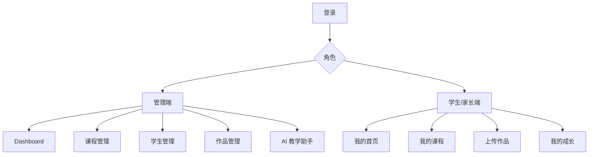
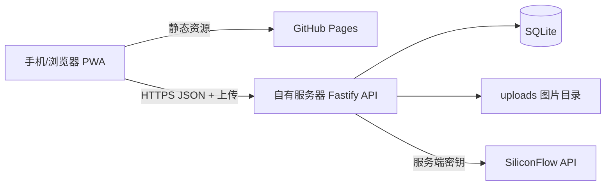

# 美术机构 AI 教学管理平台 MVP v1.0｜PRD

## 1. 产品概述

### 1.1 产品定位

面向中小型美术培训机构的轻量化教学管理 Web App。老师和管理员通过网页完成课程、学生、作品和评价管理；学生/家长通过手机浏览器查看课程任务、上传作品与成长档案。安装为 PWA 后，手机体验接近原生 App。

### 1.2 目标与非目标

**MVP 目标**

1. 让机构在一个系统内管理课程、学生与作品。
2. 让老师可快速获得儿童友好的 AI 作品点评，并编辑后保存。
3. 让学生/家长看见持续积累的学习与成长记录。
4. 前端可部署到 GitHub Pages；AI Key 和业务数据只在自有服务器侧保存。

**MVP 不做**

- 在线支付、排课/考勤、直播课、即时聊天。
- 多校区复杂权限、组织层级、数据分析报表。
- 自动识别学生身份、AI 直接给作品打分或替代教师判断。
- 原生 iOS/Android App。

### 1.3 成功指标（试运行 4 周）

| 指标 | 目标 |
| --- | --- |
| 教师创建并完成作品记录 | ≥ 30 份 |
| AI 点评被保存的比例 | ≥ 60% |
| 家长/学生查看成长档案 | ≥ 20 个活跃账号 |
| 作品上传成功率 | ≥ 95% |
| AI 点评平均响应 | ≤ 15 秒 |

## 2. 用户与角色

| 角色 | 核心诉求 | MVP 权限 |
| --- | --- | --- |
| 管理员 admin | 机构数据与人员总览 | 全部课程、学生、作品、AI 工具、账户管理 |
| 教师 teacher | 布置/记录课程，点评作品 | 课程、所带学生、作品、AI 工具 |
| 学生 student | 看任务、上传作品、看成长 | 仅本人课程、作品、点评 |
| 家长 parent | 了解孩子学习情况 | 仅绑定学生的课程、作品、点评、通知 |

> MVP 账户由管理员创建；学生与家长各使用独立账号。家长可在 v1.1 支持绑定多个孩子。

## 3. 产品范围与用户流程

### 3.1 管理端 Dashboard

展示学生数、课程数、作品数、待处理 AI 点评数，以及课程/学生/作品/AI 的快捷入口。管理员看到机构汇总，教师只看到其可访问数据。

### 3.2 课程管理

管理员或教师新建课程，填写名称、适龄范围、简介、封面；为课程新增、排序和编辑章节。章节含标题、教学内容、材料和任务说明。

### 3.3 学生管理

管理员建立学生档案：姓名、头像、出生日期或年龄、班级、监护人信息；在档案页查看其课程、作品、评价和成长时间轴。教师仅可查看分配给自己的学生。

### 3.4 作品管理与上传

教师可为学生上传课堂作品；学生可自行上传。上传后填写作品名称、课程/章节、创作想法，服务端保存图片并创建作品记录。教师可补充人工评价。

### 3.5 AI 作品点评（首要 AI 功能）

流程：选择/上传作品 → 请求后端 `/api/ai/artwork-review` → 后端读取图片、构造儿童教育提示词并请求 SiliconFlow → 返回结构化点评 → 教师可编辑、确认保存 → 学生/家长可查看。

输出结构：

```json
{
  "summary": "小朋友这次……",
  "strengths": ["想象力丰富", "色彩大胆"],
  "suggestions": ["可以尝试补充背景细节"],
  "encouragement": "下次继续大胆表达自己的想法！"
}
```

规则：AI 文案不得给分、排名、贬低儿童或作医学/心理判断；生成结果必须以“待教师确认”状态保存，教师确认后才对学生端公开。

### 3.6 学生/家长端

- 首页：正在学习的课程、今日任务、最近作品、继续学习入口。
- 我的课程：课程卡片、章节任务、完成进度。
- 上传作品：图片、名称、创作想法；上传后显示审核/点评状态。
- 我的成长：按时间倒序展示作品、教师评价和 AI 点评。

### 3.7 教案与家长反馈（MVP 后半段）

- 教案生成：老师输入主题、年龄、时长（默认 60 分钟），获得教学目标、材料、流程、延伸活动和课后总结草稿。
- 家长反馈：针对一件已确认点评的作品，一键生成家长通知草稿；教师编辑确认后复制使用。MVP 不直接发送短信/微信。

## 4. 信息架构



## 5. 功能需求与验收标准

| 编号 | 功能 | 优先级 | 验收标准 |
| --- | --- | --- | --- |
| FR-01 | 登录与角色路由 | P0 | 正确账号登录后获得 JWT；不同角色只能进入授权页面；未登录访问会跳转登录页。 |
| FR-02 | PWA | P0 | 支持安装、manifest、离线展示基础壳页；不缓存私密 API 响应。 |
| FR-03 | 管理 Dashboard | P0 | 显示本角色范围内的三项数量、待点评数和快捷入口。 |
| FR-04 | 课程与章节 CRUD | P0 | 可新增、编辑、删除课程与章节；删除需二次确认；章节排序可保存。 |
| FR-05 | 学生档案 | P0 | 可新增/编辑学生；列表可按姓名、班级搜索；档案展示作品与课程。 |
| FR-06 | 作品上传与管理 | P0 | jpg/png/webp 上传成功并得到可访问图片 URL；可关联学生、课程、章节；可删除。 |
| FR-07 | 学生端课程与成长 | P0 | 学生只可查看本人数据；可上传作品并看到历史记录。 |
| FR-08 | AI 作品点评 | P0 | AI 输出符合 JSON 结构；失败可重试；教师编辑确认前不对学生端公开。 |
| FR-09 | 教案生成 | P1 | 输入主题与年龄后生成结构化教案，可复制与保存草稿。 |
| FR-10 | 家长反馈生成 | P1 | 基于作品和确认点评生成可编辑通知草稿。 |
| FR-11 | 审计与错误记录 | P1 | 记录 AI 请求、上传失败及关键变更，管理员可用于排错。 |

## 6. 非功能与安全需求

- 支持 360px 以上手机屏幕，管理端同时适配桌面端。
- 后端仅允许 GitHub Pages 的正式域名、预览域名和本地开发域名跨域。
- 密码使用 `bcrypt` 哈希；JWT 有效期 7 天；刷新或重新登录后更新令牌。
- API 请求携带 `Authorization: Bearer <token>`；服务端每次校验角色与资源归属。
- SiliconFlow Key 仅保存在后端 `.env`，不提交 Git，不返回客户端。
- 上传限 jpg/png/webp，单文件 ≤ 10 MB；校验 MIME、扩展名和真实图片内容；以随机 UUID 文件名保存。
- 所有 AI 接口按用户限流，记录 token/耗时/结果状态，避免意外成本。
- 默认不在 AI 提示中发送学生真实姓名、联系方式、家长信息；仅发送年龄段、主题、作品图片与必要上下文。
- 生产环境使用 HTTPS；图片 URL 采用服务端授权或不可猜测路径。MVP 若使用公开静态目录，须取得家长授权并避免文件名含个人信息。

## 7. 技术边界与部署



- 前端：Vue 3 + Vite + TypeScript + Tailwind CSS + Pinia + Vue Router + vite-plugin-pwa。
- API：Node.js LTS + Fastify；REST JSON；`multipart` 接收图片。
- 数据库：单机 SQLite，启用 WAL 与每日备份。数据增长或并发增加后迁移 PostgreSQL/Supabase。
- 服务器：Docker Compose 运行 API；Nginx 反向代理 HTTPS；PM2 仅作为非 Docker 方案备选，二者不同时使用。
- 域名建议：`app.example.com`（GitHub Pages 自定义域）和 `api.example.com`（服务器）。

## 8. API 概览

| 方法 | 路径 | 权限 | 说明 |
| --- | --- | --- | --- |
| POST | `/api/auth/login` | 公开 | 登录并返回用户与 JWT |
| GET | `/api/dashboard` | admin/teacher | 角色范围内统计 |
| GET/POST | `/api/courses` | admin/teacher | 课程列表/新建 |
| GET/PATCH/DELETE | `/api/courses/:id` | admin/teacher | 单课程操作 |
| POST | `/api/courses/:id/lessons` | admin/teacher | 创建章节 |
| GET/POST | `/api/students` | admin/teacher | 学生列表/新建 |
| GET/PATCH | `/api/students/:id` | 授权用户 | 学生档案 |
| GET/POST | `/api/artworks` | 授权用户 | 列表/创建作品记录 |
| POST | `/api/uploads/images` | 授权用户 | 上传图片，返回 URL |
| GET/PATCH/DELETE | `/api/artworks/:id` | 授权用户 | 作品详情、编辑、删除 |
| POST | `/api/ai/artwork-review` | admin/teacher | 生成待确认 AI 点评 |
| POST | `/api/ai/lesson-plan` | admin/teacher | 生成教案草稿 |
| POST | `/api/ai/parent-feedback` | admin/teacher | 生成家长通知草稿 |

## 9. 发布范围与决策门

| 阶段 | 发布内容 | 进入下一阶段前须确认 |
| --- | --- | --- |
| Alpha | 登录、角色样例、两端导航、假数据页面 | 页面流程、视觉方向确认 |
| Beta | 真实课程/学生/作品/上传和权限 | 数据录入与上传流程可用 |
| MVP v1.0 | AI 作品点评 + 成长档案 + PWA | 10–20 位真实用户试用反馈 |
| v1.1 | 教案、家长反馈、批量操作、通知集成 | AI 质量与人工编辑率达标 |

